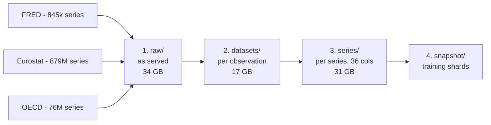
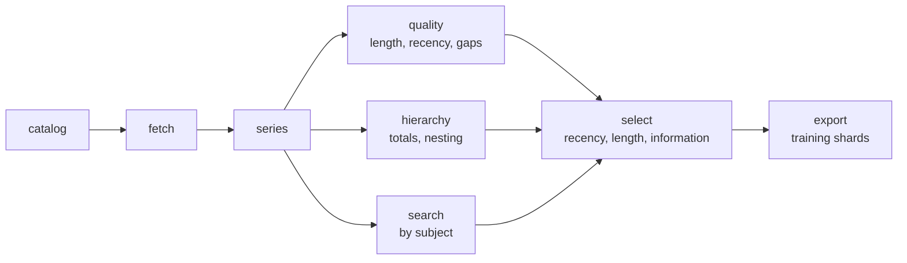

# The shape of the data

How `terrastat` is laid out, what each layer is for, and what a series looks like once it gets
there. Figures are from the corpus as it stands: **956,142,019 series, 6,275,277,391 observations**
across FRED, Eurostat and OECD.

## Four layers, each usable while the next is still being built



| layer | one row is | for |
|---|---|---|
| `raw/<source>/<dataset>/` | the bytes the source sent, gzipped | reproducibility, re-tidying without re-downloading |
| `datasets/<source>/<dataset>/` | one **observation** | tables: pandas, DuckDB, R |
| `series/<source>/freq=<F>/` | one **series**, dates and values as lists | models, text encoders |
| `snapshot/<name>/` | one series, shuffled into ~128 MB shards | training on consumer hardware |

The series layer is Hive-partitioned by source and frequency, and every file carries the **same 36
columns whatever the source**. That is what lets the whole tree be opened as one table:

```python
import polars as pl
pl.scan_parquet("data/series/**/*.parquet")     # 956M rows, one schema
```

## The series schema

36 columns in seven groups. The split matters: the first six groups are metadata that a text
encoder can read, the last is the series itself.

| group | n | columns |
|---|---:|---|
| identity | 4 | `series_uid` `source` `source_id` `dataset_id` |
| human-readable | 4 | `dataset_title` `title` `description` `notes` |
| classification | 8 | `frequency` `frequency_raw` `units` `seasonal_adjustment` `geo` `geo_label` `dimensions` `tags` |
| licence | 6 | `license_id` `license_name` `license_url` `license_detail` `attribution` `license_notes` |
| provenance | 6 | `origin_agencies` `origin_us_federal` `source_url` `last_updated` `retrieved_at` `vintage` |
| extent | 5 | `start_date` `end_date` `n_points` `n_obs` `n_flagged` |
| **the data** | 3 | `dates` `values` `flags` |

### identity

| column | type | notes |
|---|---|---|
| `series_uid` | str | `<source>:<source_id>`, globally unique |
| `source` | str | `fred`, `eurostat`, `oecd` |
| `source_id` | str | FRED series id; `<dataset>:<sdmx key>` for the SDMX sources |
| `dataset_id` | str | the dataset it came from |

### human-readable

| column | type | notes |
|---|---|---|
| `dataset_title` | str | |
| `title` | str | FRED's analyst title; the dataset title for SDMX sources |
| `description` | str | one paragraph built from **all** metadata, for text encoders |
| `notes` | str | |

### classification

| column | type | notes |
|---|---|---|
| `frequency` | str | canonical: `H D B W BW M Q S A A3 P I OTHER` |
| `frequency_raw` | str | whatever the source called it, always kept |
| `units` | str | decides whether aggregation is meaningful — see [hierarchies](#hierarchies) |
| `seasonal_adjustment` | str | |
| `geo`, `geo_label` | str | code as given, plus its label |
| `dimensions` | list of `{id, name, code, label}` | every SDMX dimension, code **and** label |
| `tags` | list of str | FRED tags where fetched; empty elsewhere |

### licence and provenance

Twelve of the 36 columns exist so a subset can be released without anyone having to re-derive its
terms. `license_id` drives `export --public-only`; `attribution` carries the exact wording each
source asks for.

| column | type | notes |
|---|---|---|
| `license_id` … `license_notes` | str | id, name, url, the source's own status string, required citation |
| `origin_agencies` | list of str | who actually produced it — FRED republishes 80,274 OECD series |
| `origin_us_federal` | bool | heuristic, FRED only: no copyright under 17 USC 105 |
| `source_url`, `last_updated`, `retrieved_at` | str | |
| `vintage` | str | **latest revision only.** See the caveat below |

### extent and data

| column | type | notes |
|---|---|---|
| `start_date`, `end_date` | date | |
| `n_points` | int | length of the lists |
| `n_obs` | int | non-missing values; `n_points − n_obs` is the gap count |
| `n_flagged` | int | points carrying a status flag |
| `dates` | list of date | |
| `values` | list of f64 | `null` where missing |
| `flags` | list of str | provisional, estimated, break in series, … |

Keeping the fixed-width columns separate from the three list columns is what makes the analysis
tools cheap: the lists are essentially all of the 31 GB, and Parquet stores columns separately, so
a scan that names only scalars never reads them. A full pass over all 956M series takes about
twelve seconds.

## The commands



## Three things the schema encodes deliberately

### Frequency is canonical, and the original is kept

`frequency` is a union of SDMX `CL_FREQ` and FRED's own strings, so `M` means monthly whatever the
source called it. `frequency_raw` keeps the original, because the mapping is lossy and someone will
eventually need to check it. Length and recency are both expressed in these units, which is what
makes an annual and a monthly series comparable at all.

### Hierarchies

**71.5% of datasets carry a reserved SDMX total code** (`_T`, `TOTAL`) in some dimension, which is
unambiguous; a further 6.4% have only a free-text label beginning "Total" or "All", which is a
judgement call — most are genuine (`TOTAL FISHERY PRODUCTS`, `All NACE activities`, `Total
economy`) but some are residual categories rather than aggregates (`Total unspecified and unknown
locations`). And 53.6% have a prefix-nested dimension such as NUTS regions where
`DE ⊃ DE1 ⊃ DE11`. So a large part of the corpus consists of series that are exact sums of other
series.

Note that 8.8% of total-carrying dimensions hold **more than one** total-looking code — one
Eurostat price dimension offers "Total crop, including fruit", "Total crop, excluding fruit",
"Total animal" and "Total agricultural goods". `aggregation_sets` resolves these when a reserved
code settles it and otherwise declines the group rather than guessing.

Whether that sum is *arithmetically* valid depends on `units`, and the most common unit in the
corpus is `Percentage` (1,927 datasets). Two datasets with identical structure:

| dataset | units | parent = Σ children |
|---|---|---|
| `demo_maeduc` | Number | 40 / 40 |
| `hlth_ehis_pe2u` | Percentage | 1 / 40 |

`terrastat hierarchy --check` verifies the arithmetic rather than trusting the structure.

### Vintages: latest revision only

Every observation is the **most recent** revision. A value labelled 2024 may have been restated in
2026 using information from 2025. This is fine for most work and wrong for genuine real-time
exercises; `vintage` records what was taken, and [leakage.md](leakage.md) sets out the consequence
in full.

## Reading it

```python
import polars as pl

# the whole tree as one table, without touching the 31 GB of values
lf = pl.scan_parquet("data/series/**/*.parquet", hive_partitioning=True)
lf.select("source", "frequency", "n_obs").group_by("source").len().collect(engine="streaming")

# one series, with its data
(lf.filter(pl.col("series_uid") == "fred:GDPC1")
   .select("title", "units", "dates", "values").collect())
```

See [MANUAL.md](../MANUAL.md) for the walkthrough and [leakage.md](leakage.md) before splitting
anything into train and test.
